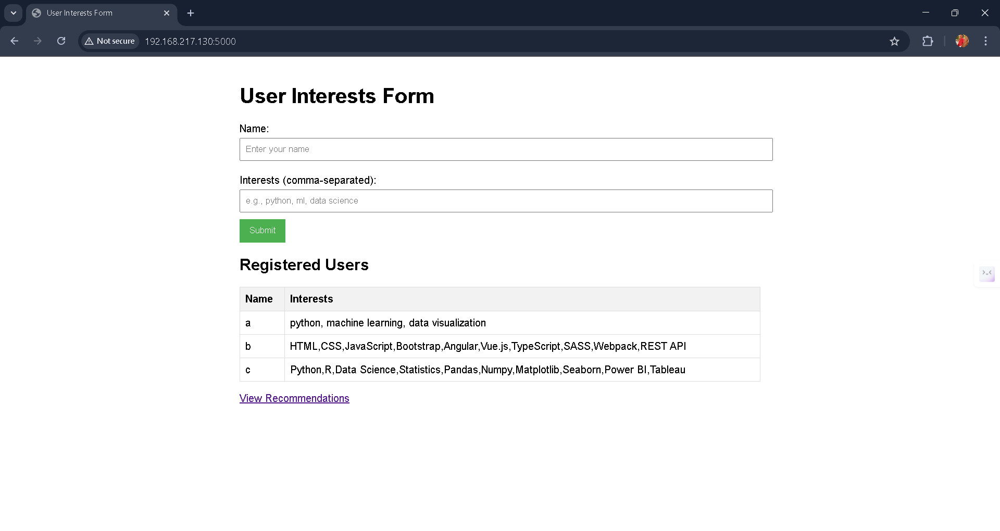
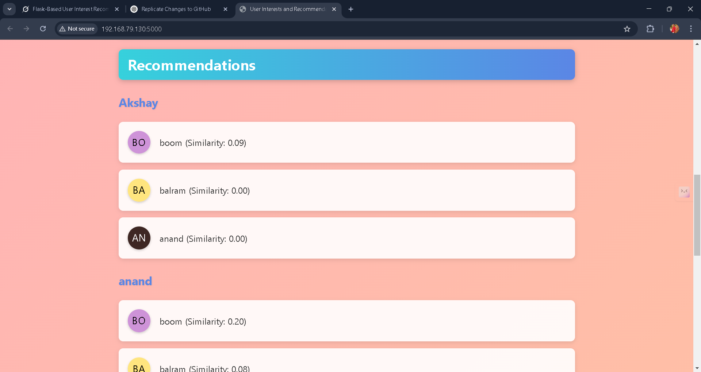

# Recommendation System Web App

## Description
This is a Flask-based web application designed to collect user names and interests through a simple form, store the data in a CSV file, and generate user-to-user recommendations based on shared interests using the Jaccard similarity metric. The app features a clean web interface with a form for input and tables to display registered users and recommendations.

## Prerequisites
- **Python 3.x**: Ensure Python 3.6 or higher is installed on your system.
- **Git**: Required to clone the repository.
- **Web Browser**: Any modern browser (e.g., Chrome, Firefox) to access the app.
- **Basic Command Line Knowledge**: For running installation and execution commands.

## Necessary Installations
To set up and run the project, follow these steps:

### Clone the Repository:
```bash
git clone https://github.com/yourusername/recommendation_system
cd recommendation-system
```

### Set Up a Virtual Environment (Recommended):
```bash
python -m venv venv
source venv/bin/activate  # On Windows: venv\Scripts\activate
```

### Install Dependencies:
```bash
pip install flask
```

## Software Stack
- **Python 3.x**: Core programming language.
- **Flask**: Lightweight web framework for routing and templating.
- **Jinja2**: Templating engine (bundled with Flask) for dynamic HTML rendering.
- **CSV**: Python’s built-in module for handling data storage.
- **HTML/CSS**: Frontend technologies for form and table styling.

## Usage
### Run the Application:
```bash
python app.py
```
The app will be available at [http://localhost:5000](http://localhost:5000).

### Interact with the App:
1. Open [http://localhost:5000](http://localhost:5000) in your browser.
2. **Submit Data**: Enter a name and comma-separated interests (e.g., `Alice, python, ml, data science`) and click "Submit".
3. **View Users**: See the list of registered users in a table.
4. **Get Recommendations**: Click "View Recommendations" to see a table of suggested users based on interest similarity.

### Example Output:
#### After adding:
```
Alice   : python, ml, visualizations
Bob     : html, css, js
Charlie : python, ml, data science
```
#### Recommendations:
```
User    | Recommended Users
Alice   | Charlie (0.5)
Bob     | No recommendations
Charlie | Alice (0.5)
```

## Issues Faced
- **Blank Page**: Initially, the app rendered a blank page due to a missing templates folder or incorrect file paths. Fixed by ensuring proper directory structure.
- **CSV Read Errors**: Empty or malformed `user_interests.csv` caused loading issues. Added error handling and debug prints to resolve.
- **Similarity Threshold**: A high threshold (e.g., 0.5) resulted in fewer recommendations. Adjusted to 0.3 for better results with small datasets.
- **Form Submission**: Missing input validation caused empty entries. Added checks for name and interests.

## Connect With Me
- **GitHub**: [Balram](https://github.com/katkuriBalram)
- **Email**: katkuribalram@gmail.com
- **LinkedIn**: [Your LinkedIn Profile](https://www.linkedin.com/in/katkuri-balram-143284248)

Feel free to open issues or reach out for questions, suggestions, or collaboration!

### Form Page:


### Recommendations Page:


## Project Structure
```
recommendation-system-web-app/
├── app.py              # Main Flask app with recommendation logic
├── templates/          # HTML templates
│   ├── index.html      # Form and user list
│   └── recommend.html  # Recommendations display
├── user_interests.csv  # Data storage (auto-generated)
└── README.md           # Project documentation
```

## Configuration
- **Threshold**: Edit `RecommendationSystem(threshold=0.3)` in `app.py` to adjust similarity cutoff.
- **Top-N**: Change `top_n=3` to modify the number of recommendations per user.

## Contributing
1. Fork the repo.
2. Create a branch: `git checkout -b feature/your-feature`.
3. Commit changes: `git commit -m "Add your feature"`.
4. Push: `git push origin feature/your-feature`.
5. Open a pull request.

## Future Enhancements
- Migrate to a database (e.g., SQLite) for scalability.
- Add user authentication and session management.
- Improve UI with Bootstrap or a similar framework.
- Implement real-time interest suggestions in the form.